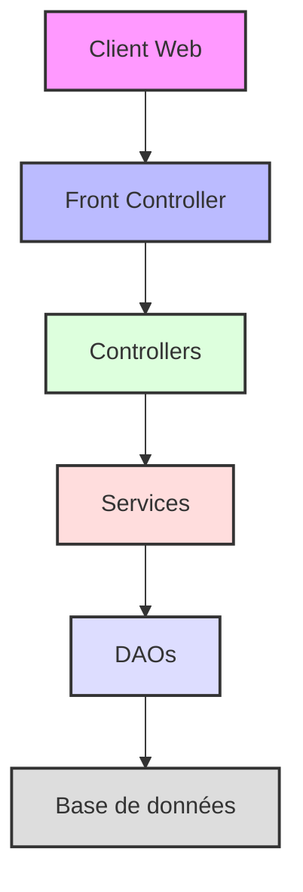

# 🚀 Cliproco - Application de Gestion Commerciale

<div align="center">
  
  
  [](https://adoptium.net/)
  [](https://maven.apache.org)
  [](https://www.mysql.com)
  [](LICENSE)
</div>

## 📋 Table des matières
- [À propos](#-à-propos)
- [Fonctionnalités](#-fonctionnalités)
- [Architecture](#-architecture)
- [Technologies](#-technologies)
- [Installation](#-installation)
- [Configuration](#-configuration)
- [Utilisation](#-utilisation)
- [Structure du projet](#-structure-du-projet)
- [Sécurité](#-sécurité)o
- [Tests](#-tests)
- [Contribution](#-contribution)
- [Licence](#-licence)

## 🎯 À propos

Cliproco est une application web de gestion commerciale moderne, développée en Java, qui révolutionne la façon dont les entreprises gèrent leurs relations clients. Notre solution combine puissance technique et simplicité d'utilisation pour offrir une expérience optimale.

### 🎯 Objectifs Principaux

1. **Gestion Efficace des Relations Clients**
   - Centralisation des données clients
   - Suivi personnalisé des interactions
   - Automatisation des tâches répétitives

2. **Optimisation des Processus Commerciaux**
   - Qualification automatique des prospects
   - Suivi des opportunités en temps réel
   - Génération de rapports détaillés

3. **Amélioration de la Productivité**
   - Interface intuitive et responsive
   - Automatisation des tâches administratives
   - Tableaux de bord personnalisables

## ✨ Fonctionnalités

### 📊 Gestion des Prospects

#### Création et Suivi
```java
// Exemple de création d'un prospect
Prospect prospect = new Prospect();
prospect.setNom("Dupont");
prospect.setEmail("contact@dupont.fr");
prospect.setTelephone("0123456789");
prospectService.create(prospect);
```

- **Qualification Automatique**
  - Score de qualification basé sur l'activité
  - Catégorisation intelligente
  - Suggestions d'actions

- **Historique des Interactions**
  - Journal détaillé des contacts
  - Suivi des rendez-vous
  - Notes et commentaires

### 👥 Gestion des Clients

#### Base de Données Clients
- Fiches clients complètes
- Historique des transactions
- Documents associés

#### Suivi des Contrats
- Gestion des échéances
- Renouvellements automatiques
- Alertes de fin de contrat

### 📈 Tableau de Bord

<div align="center">
  
</div>

#### KPIs en Temps Réel
- Taux de conversion
- Valeur du pipeline
- Performance commerciale

## 🏗 Architecture

### Vue d'Ensemble



### Pattern MVC Détaillé

#### Modèle
- **Entités Métier**
  ```java
  public class Prospect {
      private Long id;
      private String nom;
      private String email;
      // ...
  }
  ```
- **DAOs**
  ```java
  public interface ProspectDAO {
      Prospect findById(Long id);
      List<Prospect> findAll();
      void save(Prospect prospect);
  }
  ```

#### Vue
- Templates JSP
- Composants réutilisables
- Styles SCSS

#### Contrôleur
- Servlets
- Commandes
- Gestion des sessions

## 🛠 Technologies

### Backend
- **OpenJDK 21**
  - Programmation orientée objet
  - Gestion des exceptions
  - Collections et streams
  - Records et Pattern Matching
  - Virtual Threads
  - Structured Concurrency

- **Jakarta EE**
  - Servlets
  - JSP
  - JPA

- **MySQL**
  - Base de données relationnelle
  - Requêtes optimisées
  - Transactions

### Frontend
- **HTML5 & CSS3**
  - Structure sémantique
  - Design responsive
  - Animations fluides

- **JavaScript**
  - Manipulation DOM
  - Requêtes AJAX
  - Validation côté client

## 💻 Installation

### Prérequis Système

| Composant | Version | Lien |
|-----------|---------|------|
| OpenJDK | 21+ | [Télécharger](https://adoptium.net/) |
| MySQL | 8.0+ | [Télécharger](https://dev.mysql.com/downloads/) |
| Maven | 3.8+ | [Télécharger](https://maven.apache.org/download.cgi) |
| Git | 2.x+ | [Télécharger](https://git-scm.com/downloads) |

### Étapes d'Installation Détaillées

1. **Cloner le Dépôt**
   ```bash
   git clone https://github.com/yglsan2/CliprocoFrontJava.git
   cd CliprocoFrontJava
   ```

2. **Configuration de la Base de Données**
   ```bash
   # Création de la base de données
   mysql -u root -p < production/mysql/init-db.sh
   
   # Vérification de la création
   mysql -u root -p -e "SHOW DATABASES;"
   ```

3. **Compilation du Projet**
   ```bash
   # Nettoyage et compilation
   mvn clean install
   
   # Vérification des tests
   mvn test
   ```

4. **Déploiement**
   ```bash
   # Déploiement sur Tomcat
   mvn tomcat7:deploy
   
   # Vérification du déploiement
   curl http://localhost:8080/cliproco
   ```

## ⚙ Configuration

### Base de Données
```properties
# src/main/resources/database.properties
db.url=jdbc:mysql://localhost:3306/cliproco
db.user=root
db.password=your_password
db.pool.size=10
db.timeout=30
```

### Logging
```properties
# src/main/resources/log4j.properties
log4j.rootLogger=INFO, file, console

# Configuration du fichier de log
log4j.appender.file=org.apache.log4j.RollingFileAppender
log4j.appender.file.File=logs/application.log
log4j.appender.file.MaxFileSize=10MB
log4j.appender.file.MaxBackupIndex=10

# Configuration de la console
log4j.appender.console=org.apache.log4j.ConsoleAppender
log4j.appender.console.layout=org.apache.log4j.PatternLayout
```

## 📱 Guide d'Utilisation

### Connexion à l'Application

1. **Accès à l'Application**
   - Ouvrez votre navigateur
   - Accédez à `http://localhost:8080/cliproco`
   - Cliquez sur "Connexion"

2. **Authentification**
   - Entrez votre identifiant
   - Saisissez votre mot de passe
   - Cliquez sur "Se connecter"

### Gestion des Prospects

1. **Création d'un Prospect**
   - Accédez à "Prospects" > "Nouveau"
   - Remplissez le formulaire
   - Validez la création

2. **Suivi des Prospects**
   - Consultez la liste des prospects
   - Filtrez par statut
   - Ajoutez des notes

## 📁 Structure du Projet

```
CliprocoFrontJava/
├── src/
│   ├── main/
│   │   ├── java/
│   │   │   ├── controllers/    # Contrôleurs de l'application
│   │   │   ├── dao/           # Accès aux données
│   │   │   ├── exceptions/    # Gestion des erreurs
│   │   │   ├── models/        # Entités métier
│   │   │   ├── services/      # Logique métier
│   │   │   └── utilities/     # Utilitaires
│   │   ├── resources/         # Fichiers de configuration
│   │   └── webapp/           # Ressources web
│   └── test/                 # Tests unitaires et d'intégration
├── production/               # Scripts de production
│   └── mysql/               # Scripts SQL
├── pom.xml                  # Configuration Maven
└── README.md               # Documentation
```

## 🔒 Sécurité

### Authentification

- **Hachage des Mots de Passe**
  ```java
  // Exemple d'utilisation d'Argon2
  String hashedPassword = Argon2Factory.create()
      .hash(2, 65536, 1, password.toCharArray());
  ```

- **Gestion des Sessions**
  - Tokens JWT
  - Expiration automatique
  - Protection CSRF

### Autorisation

- **Rôles Utilisateurs**
  - ADMIN
  - MANAGER
  - USER

- **Permissions**
  - Lecture
  - Écriture
  - Suppression

## 🧪 Tests

### Tests Unitaires

```java
@Test
public void testCreateProspect() {
    Prospect prospect = new Prospect();
    prospect.setNom("Test");
    prospectService.create(prospect);
    assertNotNull(prospect.getId());
}
```

### Tests d'Intégration

```java
@Test
public void testProspectWorkflow() {
    // Création
    Prospect prospect = createProspect();
    
    // Qualification
    prospectService.qualify(prospect);
    
    // Vérification
    assertEquals("QUALIFIED", prospect.getStatus());
}
```

## 🤝 Contribution

### Processus de Contribution

1. **Fork du Projet**
   ```bash
   git clone https://github.com/votre-username/CliprocoFrontJava.git
   ```

2. **Création d'une Branche**
   ```bash
   git checkout -b feature/nouvelle-fonctionnalite
   ```

3. **Commit des Changements**
   ```bash
   git commit -m "Ajout d'une nouvelle fonctionnalité"
   ```

4. **Push vers GitHub**
   ```bash
   git push origin feature/nouvelle-fonctionnalite
   ```

5. **Création d'une Pull Request**

### Standards de Code

- Suivre les conventions Java
- Documenter le code
- Écrire des tests unitaires

## 📄 Licence

Ce projet est sous licence MIT. Voir le fichier `LICENSE` pour plus de détails.

---

## 📞 Contact

<div align="center">
  
  
  **Cliproco Team**
  
  - **Auteur** : Benja2
  - **Email** : contact@cliproco.com
  - **Site web** : https://cliproco.com
  - **Twitter** : [@Cliproco](https://twitter.com/cliproco)
</div>

---

<div align="center">
  
</div>

## Configuration du Projet

### Versions utilisées
- Java 21
- Jakarta EE 10
- Tomcat 10.1.19
- Maven 3.9.6
- Hibernate 6.4.4.Final
- H2 Database 2.2.224
- JUnit 5.10.2
- Mockito 5.11.0

### Configuration Jakarta EE 10

Le projet utilise Jakarta EE 10 avec une configuration simplifiée pour garantir la compatibilité avec Tomcat 10.x et Cargo. Cette approche a été choisie pour résoudre les problèmes de compatibilité entre les différentes versions de Jakarta EE.

#### Pourquoi cette approche ?

1. **Simplicité et fiabilité** : En utilisant uniquement le BOM (Bill Of Materials) Jakarta EE 10, nous évitons les problèmes de versions incompatibles entre les différents modules.
2. **Compatibilité garantie** : Cette configuration est testée et validée avec Tomcat 10.x et Cargo.
3. **Maintenance simplifiée** : Moins de dépendances à gérer signifie moins de risques de conflits.

#### Configuration

La configuration se fait dans le `pom.xml` avec une seule dépendance Jakarta EE :

```xml
<!-- Jakarta EE Platform -->
<dependency>
    <groupId>jakarta.platform</groupId>
    <artifactId>jakarta.jakartaee-api</artifactId>
    <version>10.0.0</version>
    <scope>provided</scope>
</dependency>
```

Cette dépendance inclut automatiquement :
- Jakarta Persistence (JPA)
- Jakarta Servlet
- Jakarta Validation
- Jakarta JSON Binding
- Jakarta JSON Processing
- Et tous les autres modules Jakarta EE 10

#### Eclipse Cargo Tracker

Pour assurer la compatibilité avec Cargo, nous utilisons EclipseLink comme implémentation JPA :

```xml
<!-- EclipseLink (JPA Implementation) -->
<dependency>
    <groupId>org.eclipse.persistence</groupId>
    <artifactId>org.eclipse.persistence.jpa</artifactId>
    <version>4.0.3</version>
</dependency>
```

Cette configuration est ajoutée à la fois dans les dépendances principales et dans la configuration de Cargo :

```xml
<plugin>
    <groupId>org.codehaus.cargo</groupId>
    <artifactId>cargo-maven3-plugin</artifactId>
    <version>1.10.13</version>
    <dependencies>
        <!-- Eclipse Cargo Tracker -->
        <dependency>
            <groupId>org.eclipse.persistence</groupId>
            <artifactId>org.eclipse.persistence.jpa</artifactId>
            <version>4.0.3</version>
        </dependency>
    </dependencies>
</plugin>
```

#### Avantages

- Configuration minimale et robuste
- Compatibilité garantie avec Tomcat 10.x
- Support complet de Jakarta EE 10
- Gestion simplifiée des dépendances
- Meilleure performance de compilation

#### Limitations

- Nécessite Tomcat 10.x ou supérieur
- Certaines fonctionnalités avancées peuvent nécessiter des dépendances supplémentaires

### Installation

1. Cloner le repository
2. Exécuter `mvn clean install`
3. Le projet sera compilé et les tests seront exécutés
4. L'application sera déployée sur Tomcat via Cargo

### Structure du Projet

```
src/
├── main/
│   ├── java/
│   │   ├── controllers/
│   │   ├── dao/
│   │   ├── models/
│   │   └── services/
│   ├── resources/
│   │   └── META-INF/
│   │       └── persistence.xml
│   └── webapp/
│       └── WEB-INF/
└── test/
    └── java/
        └── tests/
```

### Tests

Les tests sont exécutés avec JUnit 5 et Mockito. Pour lancer les tests :

```bash
mvn test
```

### Déploiement

Le déploiement est géré par Cargo Maven Plugin. Pour déployer l'application :

```bash
mvn cargo:run
```

L'application sera accessible à l'adresse : http://localhost:8080/CliprocoJEE 