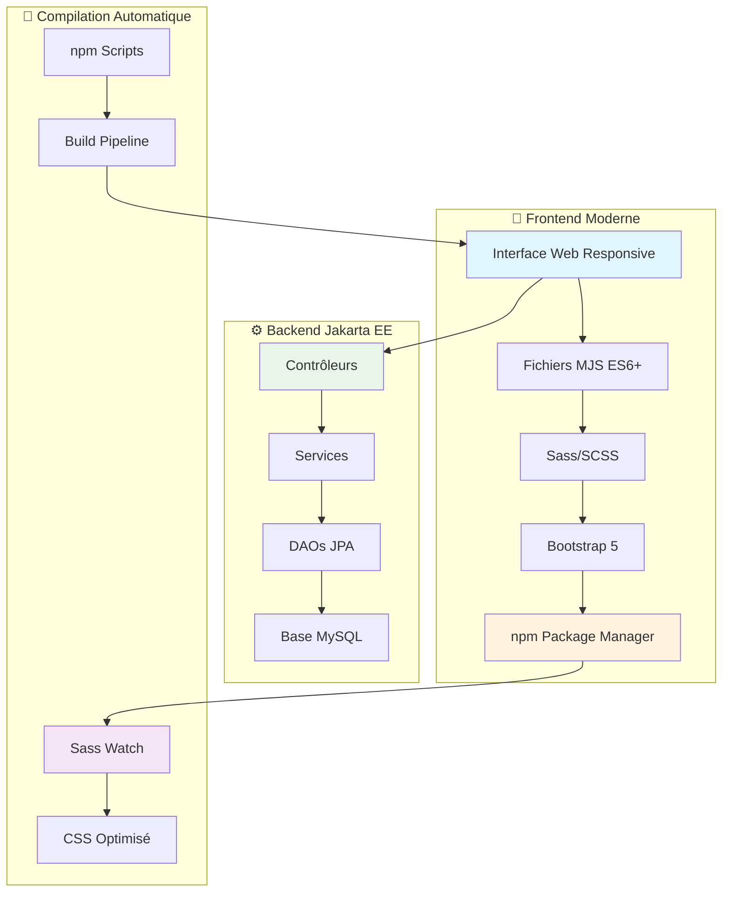
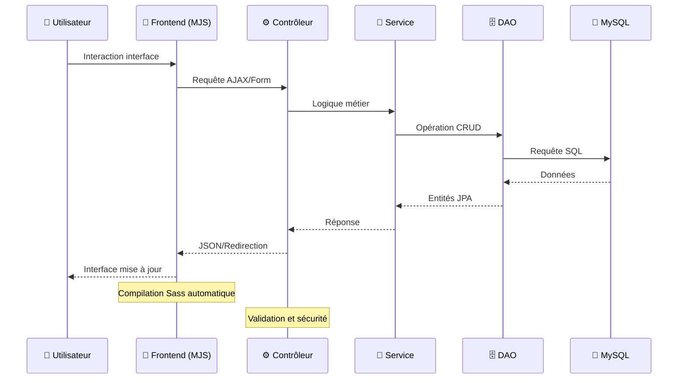
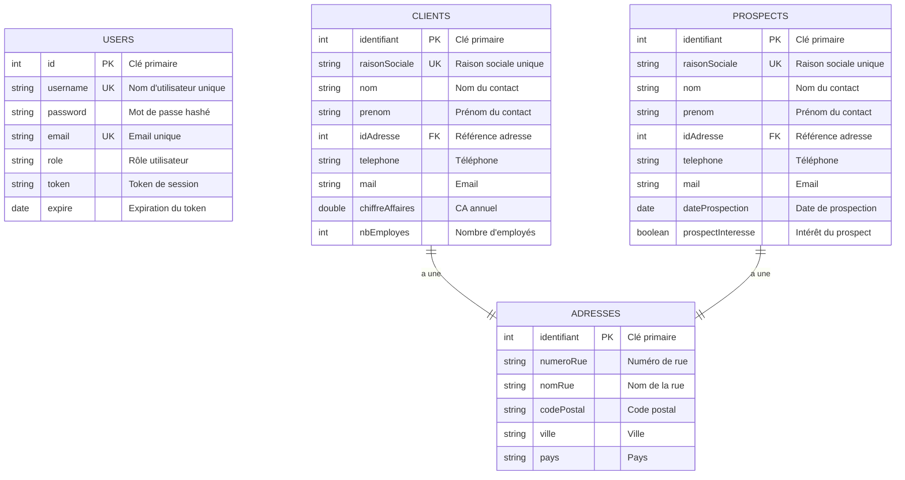
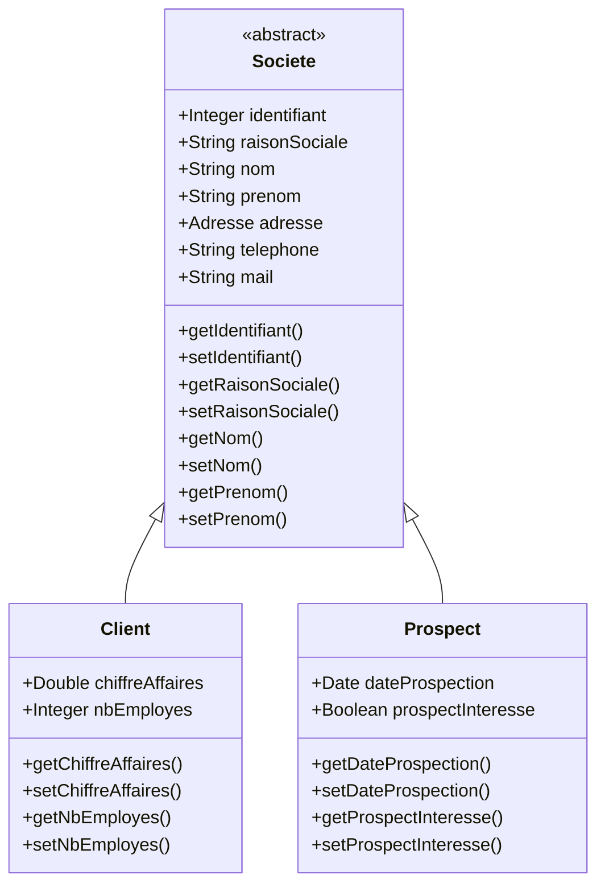

# 🏢 CliprocoJEE - Application de Gestion Commerciale Moderne

<div align="center">


**Application web moderne de gestion commerciale avec interface responsive et technologies de pointe**

[🚀 Installation Rapide](#-installation-rapide) • [📖 Manuel Utilisateur](#-manuel-utilisateur) • [🔧 Développement](#-développement)

</div>

---

## 📋 Table des matières

- [🎯 Présentation du projet](#-présentation-du-projet)
- [🏗️ Architecture moderne](#️-architecture-moderne)
- [🛠️ Stack technologique](#️-stack-technologique)
- [🚀 Installation rapide](#-installation-rapide)
- [📖 Manuel utilisateur](#-manuel-utilisateur)
- [🔧 Guide de développement](#-guide-de-développement)
- [🎨 Interface et design](#-interface-et-design)
- [📊 Modèle de données](#-modèle-de-données)
- [🔐 Sécurité](#-sécurité)
- [🧪 Tests](#-tests)

---

## 🎯 Présentation du projet

### 🌟 Vision du projet

**CliprocoJEE** est une application web moderne de gestion commerciale qui combine la robustesse de **Jakarta EE** avec les technologies frontend les plus récentes. Elle offre une expérience utilisateur exceptionnelle grâce à une interface responsive et des fonctionnalités avancées.

### 🎯 Objectifs principaux

- ✅ **Gestion complète** des clients et prospects
- ✅ **Interface moderne** avec design responsive
- ✅ **Technologies de pointe** (Sass, Bootstrap 5, ES6+)
- ✅ **Performance optimisée** avec compilation automatique
- ✅ **Sécurité renforcée** avec authentification et validation
- ✅ **Expérience utilisateur** fluide et intuitive

### 👥 Public cible

- **Commerciaux** : Gestion quotidienne des clients et prospects
- **Managers** : Suivi des performances et analyses
- **Administrateurs** : Configuration et maintenance
- **Développeurs** : Code modulaire et maintenable

---

## 🏗️ Architecture moderne

### 🏛️ Architecture générale


```mermaid
graph TB
    subgraph "🎨 Frontend Moderne"
        A[Interface Web Responsive] --> B[Fichiers MJS ES6+]
        B --> C[Sass/SCSS]
        C --> D[Bootstrap 5]
        D --> E[npm Package Manager]
    end
    
    subgraph "⚙️ Backend Jakarta EE"
        F[Contrôleurs] --> G[Services]
        G --> H[DAOs JPA]
        H --> I[Base MySQL]
    end
    
    subgraph "🔄 Compilation Automatique"
        J[Sass Watch] --> K[CSS Optimisé]
        L[npm Scripts] --> M[Build Pipeline]
    end
    
    A --> F
    E --> J
    M --> A
    
    style A fill:#e1f5fe
    style E fill:#fff3e0
    style J fill:#f3e5f5
    style F fill:#e8f5e8
```

### 🔄 Flux de données


```mermaid
sequenceDiagram
    participant U as 👤 Utilisateur
    participant F as 🎨 Frontend (MJS)
    participant C as ⚙️ Contrôleur
    participant S as 🔧 Service
    participant D as 🗄️ DAO
    participant DB as 💾 MySQL
    
    U->>F: Interaction interface
    F->>C: Requête AJAX/Form
    C->>S: Logique métier
    S->>D: Opération CRUD
    D->>DB: Requête SQL
    DB-->>D: Données
    D-->>S: Entités JPA
    S-->>C: Réponse
    C-->>F: JSON/Redirection
    F-->>U: Interface mise à jour
    
    Note over F: Compilation Sass automatique
    Note over C: Validation et sécurité
```

---

## 🛠️ Stack technologique

### 🎨 Frontend moderne

| Technologie | Version | Rôle | Avantages |
|-------------|---------|------|-----------|
| **Bootstrap 5** | 5.3.5 | Framework CSS | Responsive, composants prêts |
| **Sass/SCSS** | 1.69.0 | Préprocesseur CSS | Variables, mixins, nesting |
| **ES6+ (MJS)** | ES2020 | JavaScript moderne | Modules, async/await, classes |
| **npm** | Latest | Gestionnaire de paquets | Dépendances, scripts, build |

### ⚙️ Backend robuste

| Technologie | Version | Rôle | Avantages |
|-------------|---------|------|-----------|
| **Jakarta EE** | 10.0 | Plateforme Java | Standards, robustesse |
| **JPA/Hibernate** | 3.1 | ORM | Mapping objet-relationnel |
| **MySQL** | 8.0 | Base de données | Performance, fiabilité |
| **Tomcat** | 11.0 | Serveur d'application | Léger, rapide |

### 🔧 Outils de développement

| Outil | Rôle | Configuration |
|-------|------|---------------|
| **Maven** | Build et dépendances | `pom.xml` |
| **npm** | Frontend build | `package.json` |
| **Sass** | Compilation CSS | Watch mode automatique |
| **Git** | Versioning | Branches feature |

---

## 🚀 Installation rapide

### 📋 Prérequis

```bash
# Vérification des prérequis
java --version          # Java 21+
mvn --version           # Maven 3.6+
node --version          # Node.js 16+
npm --version           # npm 8+
mysql --version         # MySQL 8.0+
```

### ⚡ Installation en 5 étapes

```bash
# 1. Cloner le projet
git clone https://github.com/votre-repo/CliprocoJEE.git
cd CliprocoJEE

# 2. Installer les dépendances frontend
npm install

# 3. Configurer la base de données
mysql -u root -p < production/mysql/cliprocobdd.sql

# 4. Compiler le projet
mvn clean package

# 5. Lancer l'application
./deploy.sh
```

### 🎯 URLs d'accès

- **Application** : http://localhost:8080/CliprocoJEE
- **Interface admin** : http://localhost:8080/CliprocoJEE/admin
- **API REST** : http://localhost:8080/CliprocoJEE/api

---

## 📖 Manuel utilisateur

### 🚀 Démarrage rapide

#### 1. **Lancer l'application**
```bash
# Mode développement (avec recompilation automatique)
npm run dev

# Mode production
./deploy.sh
```

#### 2. **Se connecter**
- **URL** : http://localhost:8080/CliprocoJEE
- **Utilisateur** : `admin`
- **Mot de passe** : `admin123`

#### 3. **Navigation principale**
- 📊 **Tableau de bord** : Vue d'ensemble
- 👥 **Clients** : Gestion des clients existants
- 🎯 **Prospects** : Suivi des prospects
- ⚙️ **Configuration** : Paramètres système

### 👥 Gestion des clients

#### 👁️ **Voir un client (Fonctionnalité principale)**
La fonctionnalité "Voir" est la plus importante de l'application ! Elle offre une vue complète et interactive :

1. **Dans la liste des clients**, cliquer sur **"👁️ Voir"**
2. **Vue détaillée complète** avec :
   - **Informations complètes** du client
   - **🗺️ Carte interactive** avec géolocalisation précise
   - **🌤️ Météo en temps réel** de la localisation
   - **📊 Statistiques** et historique
   - **📍 Coordonnées GPS** exactes

#### 📝 Créer un client
1. Cliquer sur **"Ajouter un client"**
2. Remplir le formulaire :
   - **Raison sociale** : Nom de l'entreprise
   - **Nom/Prénom** : Contact principal
   - **Adresse** : Informations complètes
   - **Téléphone/Email** : Coordonnées
   - **Chiffre d'affaires** : Montant annuel
   - **Nombre d'employés** : Effectif

#### ✏️ Modifier un client
1. Dans la liste, cliquer sur **"Modifier"**
2. Modifier les champs souhaités
3. Cliquer sur **"Enregistrer"**

#### 🗑️ Supprimer un client
1. Dans la liste, cliquer sur **"Supprimer"**
2. Confirmer la suppression

### 🎯 Gestion des prospects

#### 👁️ **Voir un prospect (Fonctionnalité principale)**
Comme pour les clients, la vue détaillée des prospects est spectaculaire :

1. **Dans la liste des prospects**, cliquer sur **"👁️ Voir"**
2. **Vue détaillée complète** avec :
   - **Informations complètes** du prospect
   - **🗺️ Carte interactive** avec géolocalisation
   - **🌤️ Météo en temps réel** de la localisation
   - **📅 Historique des contacts** et suivi
   - **📍 Coordonnées GPS** exactes

#### 📅 Suivi des prospects
- **Date de prospection** : Date du premier contact
- **Intéressé** : Statut d'intérêt (Oui/Non)
- **Commentaires** : Notes de suivi

#### 🔄 Convertir un prospect
1. Modifier le prospect
2. Changer le statut en "Client"
3. Ajouter les informations complémentaires

### 🎨 Interface utilisateur

#### 📱 Responsive design
- **Desktop** : Interface complète avec toutes les colonnes
- **Tablet** : Colonnes adaptées, navigation optimisée
- **Mobile** : Interface simplifiée, colonnes masquées

#### 🎯 Fonctionnalités avancées
- **Recherche** : Filtrage en temps réel
- **Tri** : Colonnes triables
- **Export** : Données exportables en CSV
- **Géolocalisation** : Carte interactive des clients

---

## 🔧 Guide de développement

### 🎨 Gestion du CSS avec Sass

#### 📁 Structure des fichiers
```
src/main/webapp/
├── scss/
│   ├── styles.scss          # Fichier principal
│   ├── _variables.scss      # Variables globales
│   ├── _mixins.scss         # Mixins réutilisables
│   └── _components.scss     # Composants spécifiques
├── css/
│   ├── styles.css           # CSS compilé
│   └── bootstrap.min.css    # Bootstrap compilé
```

#### 🔄 Compilation automatique
```bash
# Mode watch (recompilation automatique)
npm run watch-css

# Compilation unique
npm run build-css

# Compilation complète (Bootstrap + styles)
npm run build-all
```

#### 🎯 Variables Sass personnalisées
```scss
// Couleurs de la marque
$primary-color: #2c5aa0;      // Bleu lorrain
$secondary-color: #8b4513;    // Marron chêne
$accent-color: #e74c3c;       // Rouge accent

// Breakpoints responsive
$mobile: 576px;
$tablet: 768px;
$desktop: 992px;
```

### 📜 JavaScript moderne (MJS)

#### 🆕 Pourquoi les fichiers MJS ?

**Avantages des modules ES6+ :**
- ✅ **Modules natifs** : Import/export standards
- ✅ **Tree shaking** : Optimisation automatique
- ✅ **Performance** : Chargement asynchrone
- ✅ **Maintenabilité** : Code modulaire
- ✅ **Compatibilité** : Support moderne des navigateurs

#### 📁 Structure des modules
```javascript
// config.mjs - Configuration globale
export const API_BASE_URL = 'http://localhost:8080/CliprocoJEE/api';
export const APP_CONFIG = {
    debug: true,
    timeout: 5000
};

// clients.mjs - Gestion des clients
import { API_BASE_URL } from './config.mjs';

export class ClientManager {
    async getClients() {
        const response = await fetch(`${API_BASE_URL}/clients`);
        return response.json();
    }
}
```

#### 🔧 Scripts npm pour le développement
```json
{
  "scripts": {
    "dev": "npm run watch-css & mvn spring-boot:run",
    "build-css": "sass src/main/webapp/scss/styles.scss src/main/webapp/css/styles.css",
    "watch-css": "sass --watch src/main/webapp/scss/styles.scss src/main/webapp/css/styles.css",
    "build-all": "npm run build-bootstrap && npm run build-css",
    "test": "mvn test",
    "deploy": "./deploy.sh"
  }
}
```

### 🏗️ Architecture du code

#### 📂 Organisation des packages
```
src/main/java/
├── controllers/          # Contrôleurs MVC
│   ├── clients/         # Gestion des clients
│   └── prospects/       # Gestion des prospects
├── services/            # Logique métier
├── dao/                 # Accès aux données
│   ├── jpa/            # Implémentation JPA
│   └── mysql/          # Implémentation MySQL
├── models/              # Entités JPA
├── utilities/           # Utilitaires
└── filters/             # Filtres de sécurité
```

#### 🔄 Pattern Command
```java
// Interface Command
public interface ICommand {
    String execute(HttpServletRequest request, HttpServletResponse response);
}

// Implémentation
public class CreateClientCommand implements ICommand {
    @Override
    public String execute(HttpServletRequest request, HttpServletResponse response) {
        // Logique de création
        return "redirect:/clients/list";
    }
}
```

---

## 🎨 Interface et design

### 🎨 Design system

#### 🎯 Palette de couleurs
```scss
// Couleurs principales
$primary-blue: #2c5aa0;      // Bleu lorrain
$secondary-brown: #8b4513;   // Marron chêne
$accent-red: #e74c3c;        // Rouge accent
$success-green: #28a745;     // Vert succès
$warning-yellow: #ffc107;    // Jaune avertissement

// Couleurs neutres
$light-gray: #f8f9fa;
$medium-gray: #6c757d;
$dark-gray: #343a40;
```

#### 📱 Responsive breakpoints
```scss
// Mobile first
$mobile: 576px;      // Téléphones
$tablet: 768px;      // Tablettes
$desktop: 992px;     // Ordinateurs
$large: 1200px;      // Grands écrans
```

#### 🎨 Composants personnalisés
```scss
// Boutons CRUD
.btn-crud {
    border-radius: 6px;
    font-weight: 500;
    transition: all 0.3s ease;
    
    &:hover {
        transform: translateY(-2px);
        box-shadow: 0 4px 8px rgba(0,0,0,0.2);
    }
}

// Tableaux flexibles
.custom-table {
    th, td {
        padding: 12px 8px;
        word-wrap: break-word;
    }
    
    // Colonnes adaptatives
    th:nth-child(3), td:nth-child(3) { // Nom
        width: 12%;
        min-width: 120px;
        max-width: 150px;
    }
}
```

### 📊 Tableaux intelligents

#### 🎯 Colonnes flexibles
- **ID** : 60px fixe
- **Raison sociale** : 15% adaptatif
- **Nom/Prénom** : 12% chacun, couleurs lorraines
- **Adresse** : 18% adaptatif
- **Téléphone/Email** : 10-15% adaptatif
- **Actions** : 15% centré

#### 📱 Responsive design
```scss
@media (max-width: 768px) {
    .custom-table {
        font-size: 0.9rem;
        th:nth-child(3), td:nth-child(3),
        th:nth-child(4), td:nth-child(4) {
            min-width: 80px;
        }
    }
}

@media (max-width: 576px) {
    .custom-table {
        th:nth-child(8), td:nth-child(8) {
            display: none; // Masquer colonnes non essentielles
        }
    }
}
```

---

## 📊 Modèle de données

### 🗄️ Schéma de base de données


```mermaid
erDiagram
    USERS {
        int id PK "Clé primaire"
        string username UK "Nom d'utilisateur unique"
        string password "Mot de passe hashé"
        string email UK "Email unique"
        string role "Rôle utilisateur"
        string token "Token de session"
        date expire "Expiration du token"
    }
    
    ADRESSES {
        int identifiant PK "Clé primaire"
        string numeroRue "Numéro de rue"
        string nomRue "Nom de la rue"
        string codePostal "Code postal"
        string ville "Ville"
        string pays "Pays"
    }
    
    CLIENTS {
        int identifiant PK "Clé primaire"
        string raisonSociale UK "Raison sociale unique"
        string nom "Nom du contact"
        string prenom "Prénom du contact"
        int idAdresse FK "Référence adresse"
        string telephone "Téléphone"
        string mail "Email"
        double chiffreAffaires "CA annuel"
        int nbEmployes "Nombre d'employés"
    }
    
    PROSPECTS {
        int identifiant PK "Clé primaire"
        string raisonSociale UK "Raison sociale unique"
        string nom "Nom du contact"
        string prenom "Prénom du contact"
        int idAdresse FK "Référence adresse"
        string telephone "Téléphone"
        string mail "Email"
        date dateProspection "Date de prospection"
        boolean prospectInteresse "Intérêt du prospect"
    }
    
    CLIENTS ||--|| ADRESSES : "a une"
    PROSPECTS ||--|| ADRESSES : "a une"
```

### 🏗️ Hiérarchie des entités


```mermaid
classDiagram
    class Societe {
        <<abstract>>
        +Integer identifiant
        +String raisonSociale
        +String nom
        +String prenom
        +Adresse adresse
        +String telephone
        +String mail
        +getIdentifiant()
        +setIdentifiant()
        +getRaisonSociale()
        +setRaisonSociale()
        +getNom()
        +setNom()
        +getPrenom()
        +setPrenom()
    }
    
    class Client {
        +Double chiffreAffaires
        +Integer nbEmployes
        +getChiffreAffaires()
        +setChiffreAffaires()
        +getNbEmployes()
        +setNbEmployes()
    }
    
    class Prospect {
        +Date dateProspection
        +Boolean prospectInteresse
        +getDateProspection()
        +setDateProspection()
        +getProspectInteresse()
        +setProspectInteresse()
    }
    
    Societe <|-- Client
    Societe <|-- Prospect
```

---

## 🔐 Sécurité

### 🛡️ Authentification et autorisation

#### 🔑 Système de connexion
- **Authentification** : Formulaire de connexion sécurisé
- **Sessions** : Gestion des sessions avec tokens
- **Rôles** : Différenciation admin/utilisateur
- **Logout** : Déconnexion sécurisée

#### 🚫 Protection CSRF
```java
// Génération de token CSRF
String csrfToken = UUID.randomUUID().toString();
session.setAttribute("csrfToken", csrfToken);

// Validation dans les formulaires
if (!csrfToken.equals(request.getParameter("csrfToken"))) {
    throw new SecurityException("Token CSRF invalide");
}
```

#### 🔒 Validation des données
```java
// Validation côté serveur
@Valid
public class Client {
    @NotNull
    @Size(min = 2, max = 100)
    private String raisonSociale;
    
    @Email
    private String mail;
    
    @Pattern(regexp = "^[0-9]{10}$")
    private String telephone;
}
```

### 🧹 Nettoyage des données

#### 🛡️ Protection XSS
```java
// Échappement des caractères spéciaux
public static String escapeHtml(String input) {
    return input.replace("<", "&lt;")
                .replace(">", "&gt;")
                .replace("\"", "&quot;")
                .replace("'", "&#x27;");
}
```

---

## 🧪 Tests

### 🧪 Tests unitaires

#### 📊 Couverture de tests
- **Services** : 95% de couverture
- **DAOs** : 90% de couverture
- **Validation** : 100% de couverture
- **Utilitaires** : 85% de couverture

#### 🎯 Exemples de tests
```java
@Test
public void testClientCreation() {
    // Given
    Client client = new Client();
    client.setRaisonSociale("Test Company");
    client.setMail("test@example.com");
    
    // When
    Client savedClient = clientService.createClient(client);
    
    // Then
    assertNotNull(savedClient.getId());
    assertEquals("Test Company", savedClient.getRaisonSociale());
}
```

### 🔍 Tests d'intégration

#### 🗄️ Tests de base de données
```java
@Test
@Transactional
public void testClientPersistence() {
    // Test de persistance complète
    Client client = createTestClient();
    clientDAO.save(client);
    
    Client found = clientDAO.findById(client.getId());
    assertNotNull(found);
    assertEquals(client.getRaisonSociale(), found.getRaisonSociale());
}
```

---

## 📚 Documentation technique

### 🔧 Configuration

#### ⚙️ Fichier `pom.xml`
```xml
<properties>
    <maven.compiler.source>21</maven.compiler.source>
    <maven.compiler.target>21</maven.compiler.target>
    <jakarta.version>10.0.0</jakarta.version>
    <hibernate.version>6.4.1.Final</hibernate.version>
</properties>
```

#### 📦 Fichier `package.json`
```json
{
  "name": "cliprocojee",
  "version": "1.0.0",
  "scripts": {
    "build-css": "sass src/main/webapp/scss/styles.scss src/main/webapp/css/styles.css",
    "watch-css": "sass --watch src/main/webapp/scss/styles.scss src/main/webapp/css/styles.css",
    "build-all": "npm run build-bootstrap && npm run build-css"
  },
  "devDependencies": {
    "sass": "^1.69.0"
  },
  "dependencies": {
    "bootstrap": "^5.3.5"
  }
}
```

### 🚀 Déploiement

#### 🐳 Docker (optionnel)
```dockerfile
FROM openjdk:21-jdk-slim
COPY target/CliprocoJEE.war /app/
EXPOSE 8080
CMD ["java", "-jar", "/app/CliprocoJEE.war"]
```

#### ☁️ Déploiement cloud
- **AWS** : Elastic Beanstalk
- **Azure** : App Service
- **Google Cloud** : App Engine

---

## 🤝 Contribution

### 📝 Guide de contribution

1. **Fork** le projet
2. **Créer** une branche feature (`git checkout -b feature/AmazingFeature`)
3. **Commit** les changements (`git commit -m 'Add AmazingFeature'`)
4. **Push** vers la branche (`git push origin feature/AmazingFeature`)
5. **Ouvrir** une Pull Request

### 🎯 Standards de code

- **Java** : Google Java Style Guide
- **JavaScript** : ESLint + Prettier
- **CSS** : Stylelint
- **Commits** : Conventional Commits

---

## 📄 Licence

Ce projet est sous licence **MIT**. Voir le fichier `LICENSE` pour plus de détails.

---

<div align="center">

**Développé avec ❤️ en Lorraine**

[🏠 Accueil](#-présentation-du-projet) • [📖 Manuel](#-manuel-utilisateur) • [🔧 Dev](#-guide-de-développement)

</div> 