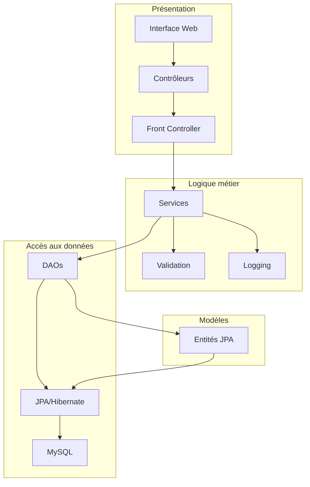
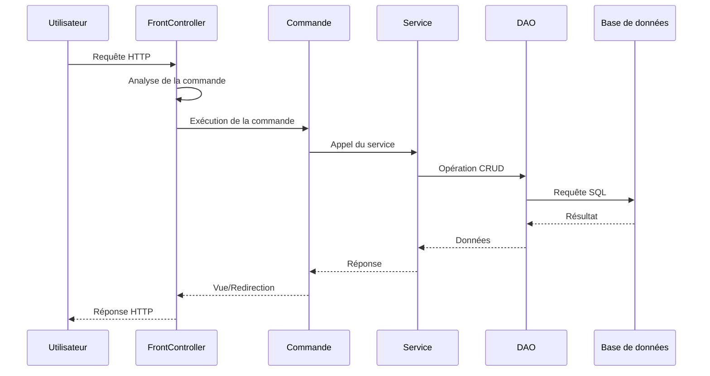
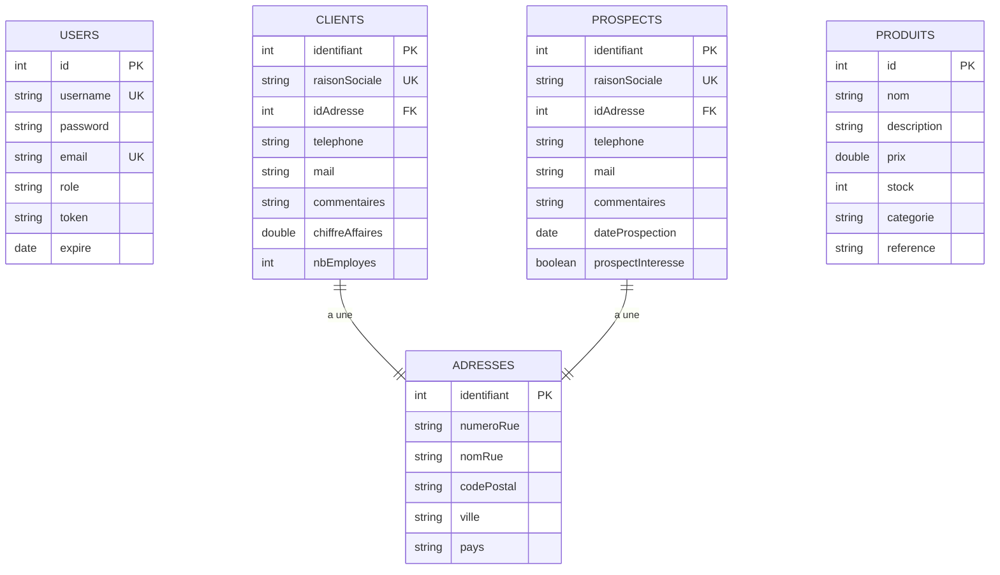
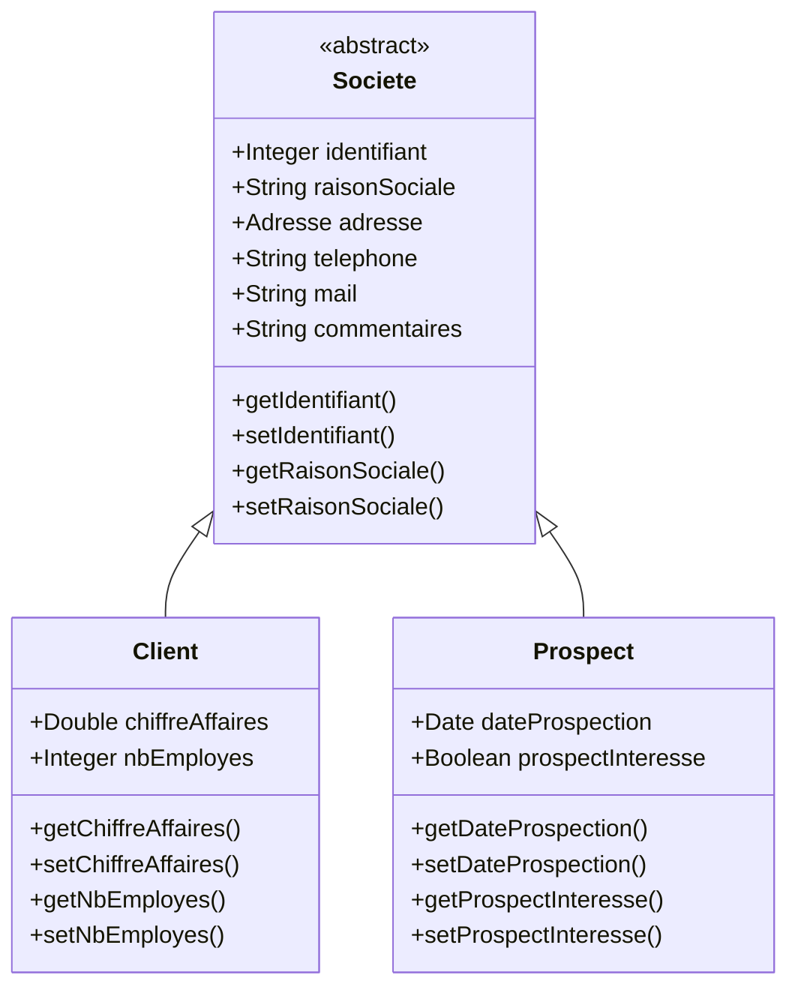
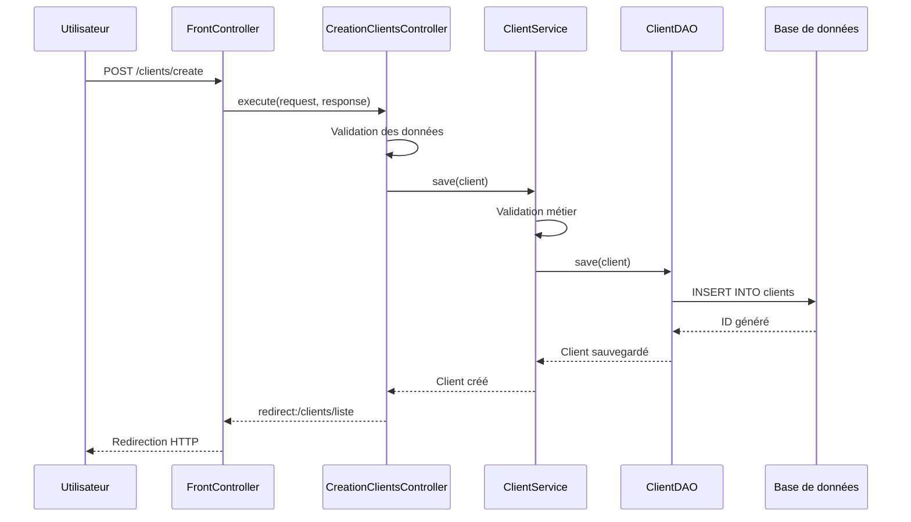
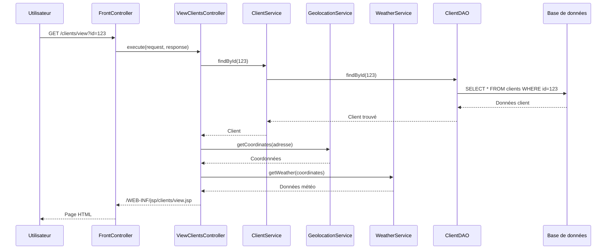

# 🏢 CliprocoJEE - Application de Gestion Commerciale

## 📋 Table des matières

- [🎯 Présentation du projet](#-présentation-du-projet)
- [🏗️ Architecture de l'application](#️-architecture-de-lapplication)
- [📊 Modèle de données](#-modèle-de-données)
- [🔧 Technologies utilisées](#-technologies-utilisées)
- [🚀 Installation et déploiement](#-installation-et-déploiement)
- [💻 Structure du code](#-structure-du-code)
- [🎨 Interface utilisateur](#-interface-utilisateur)
- [🔐 Sécurité et authentification](#-sécurité-et-authentification)
- [📈 Fonctionnalités métier](#-fonctionnalités-métier)
- [🧪 Tests et validation](#-tests-et-validation)
- [📚 Documentation technique](#-documentation-technique)

---

## 🎯 Présentation du projet

### Contexte et objectifs

**CliprocoJEE** est une application web de gestion commerciale développée en **Jakarta EE** pour une entreprise fictive spécialisée dans la gestion de clients et prospects. L'application permet de :

- ✅ **Gérer les clients** : Création, modification, suppression et consultation
- ✅ **Gérer les prospects** : Suivi des clients potentiels avec dates de prospection
- ✅ **Authentification sécurisée** : Système de connexion avec gestion des rôles
- ✅ **Interface moderne** : Interface responsive avec cartes géographiques et météo
- ✅ **Persistance robuste** : Utilisation de JPA/Hibernate avec MySQL

### Public cible

Cette application est destinée aux **commerciaux** et **managers** qui ont besoin de :
- Suivre leurs clients existants
- Gérer leur pipeline de prospects
- Consulter des informations géographiques et météorologiques
- Accéder à une interface intuitive et moderne

---

## 🏗️ Architecture de l'application

### Architecture générale

L'application suit le pattern **MVC (Model-View-Controller)** avec une architecture en couches :


```mermaid
graph TB
    subgraph "Présentation"
        A[Interface Web] --> B[Contrôleurs]
        B --> C[Front Controller]
    end
    
    subgraph "Logique métier"
        D[Services] --> E[Validation]
        D --> F[Logging]
    end
    
    subgraph "Accès aux données"
        G[DAOs] --> H[JPA/Hibernate]
        H --> I[MySQL]
    end
    
    subgraph "Modèles"
        J[Entités JPA]
    end
    
    C --> D
    D --> G
    G --> J
    J --> H
```

### Pattern Command

L'application utilise le **pattern Command** pour gérer les requêtes :


```mermaid
sequenceDiagram
    participant U as Utilisateur
    participant FC as FrontController
    participant C as Commande
    participant S as Service
    participant DAO as DAO
    participant DB as Base de données
    
    U->>FC: Requête HTTP
    FC->>FC: Analyse de la commande
    FC->>C: Exécution de la commande
    C->>S: Appel du service
    S->>DAO: Opération CRUD
    DAO->>DB: Requête SQL
    DB-->>DAO: Résultat
    DAO-->>S: Données
    S-->>C: Réponse
    C-->>FC: Vue/Redirection
    FC-->>U: Réponse HTTP
```

---

## 📊 Modèle de données

### Schéma de base de données


```mermaid
erDiagram
    USERS {
        int id PK
        string username UK
        string password
        string email UK
        string role
        string token
        date expire
    }
    
    ADRESSES {
        int identifiant PK
        string numeroRue
        string nomRue
        string codePostal
        string ville
        string pays
    }
    
    CLIENTS {
        int identifiant PK
        string raisonSociale UK
        int idAdresse FK
        string telephone
        string mail
        string commentaires
        double chiffreAffaires
        int nbEmployes
    }
    
    PROSPECTS {
        int identifiant PK
        string raisonSociale UK
        int idAdresse FK
        string telephone
        string mail
        string commentaires
        date dateProspection
        boolean prospectInteresse
    }
    
    PRODUITS {
        int id PK
        string nom
        string description
        double prix
        int stock
        string categorie
        string reference
    }
    
    CLIENTS ||--|| ADRESSES : "a une"
    PROSPECTS ||--|| ADRESSES : "a une"
```

### Hiérarchie des entités


```mermaid
classDiagram
    class Societe {
        <<abstract>>
        +Integer identifiant
        +String raisonSociale
        +Adresse adresse
        +String telephone
        +String mail
        +String commentaires
        +getIdentifiant()
        +setIdentifiant()
        +getRaisonSociale()
        +setRaisonSociale()
    }
    
    class Client {
        +Double chiffreAffaires
        +Integer nbEmployes
        +getChiffreAffaires()
        +setChiffreAffaires()
        +getNbEmployes()
        +setNbEmployes()
    }
    
    class Prospect {
        +Date dateProspection
        +Boolean prospectInteresse
        +getDateProspection()
        +setDateProspection()
        +getProspectInteresse()
        +setProspectInteresse()
    }
    
    Societe <|-- Client
    Societe <|-- Prospect
```

---

## 🔧 Technologies utilisées

### Stack technique

| **Couche** | **Technologie** | **Version** | **Rôle** |
|------------|----------------|-------------|----------|
| **Présentation** | JSP/Servlet | Jakarta EE 10 | Interface utilisateur |
| **Logique métier** | Java | 21 | Services et validation |
| **Persistance** | JPA/Hibernate | 3.1.0 | Mapping objet-relationnel |
| **Base de données** | MySQL | 8.0 | Stockage des données |
| **Serveur** | Apache Tomcat | 10.1 | Conteneur web |
| **Build** | Maven | 3.9.0 | Gestion des dépendances |
| **Frontend** | Bootstrap | 5.3 | Interface responsive |
| **Cartes** | Leaflet.js | 1.9.0 | Géolocalisation |
| **Météo** | API Infoclimat | - | Données météorologiques |

### Dépendances principales

```xml
<dependencies>
    <!-- Jakarta EE -->
    <dependency>
        <groupId>jakarta.servlet</groupId>
        <artifactId>jakarta.servlet-api</artifactId>
        <version>6.0.0</version>
    </dependency>
    
    <!-- JPA/Hibernate -->
    <dependency>
        <groupId>org.hibernate.orm</groupId>
        <artifactId>hibernate-core</artifactId>
        <version>6.2.0.Final</version>
    </dependency>
    
    <!-- MySQL -->
    <dependency>
        <groupId>mysql</groupId>
        <artifactId>mysql-connector-java</artifactId>
        <version>8.0.33</version>
    </dependency>
    
    <!-- Logging -->
    <dependency>
        <groupId>org.slf4j</groupId>
        <artifactId>slf4j-api</artifactId>
        <version>2.0.7</version>
    </dependency>
</dependencies>
```

---

## 🚀 Installation et déploiement

### Prérequis

- **Java** : Version 21 ou supérieure
- **Maven** : Version 3.9.0 ou supérieure
- **MySQL** : Version 8.0 ou supérieure
- **Tomcat** : Version 10.1 ou supérieure

### Étapes d'installation

#### 1. Configuration de la base de données

```sql
-- Création de la base de données
CREATE DATABASE cliprocobdd CHARACTER SET utf8mb4 COLLATE utf8mb4_unicode_ci;

-- Création de l'utilisateur
CREATE USER 'cliproco'@'localhost' IDENTIFIED BY 'password';
GRANT ALL PRIVILEGES ON cliprocobdd.* TO 'cliproco'@'localhost';
FLUSH PRIVILEGES;
```

#### 2. Configuration de l'application

**Fichier `src/main/resources/database.properties` :**
```properties
# Configuration de la base de données
jdbc.driver=com.mysql.cj.jdbc.Driver
jdbc.url=jdbc:mysql://localhost:3306/cliprocobdd?useSSL=false&serverTimezone=UTC
jdbc.username=cliproco
jdbc.password=password

# Configuration JPA
hibernate.dialect=org.hibernate.dialect.MySQLDialect
hibernate.hbm2ddl.auto=update
hibernate.show_sql=true
hibernate.format_sql=true
```

#### 3. Compilation et déploiement

```bash
# Compilation du projet
mvn clean package -DskipTests

# Déploiement sur Tomcat
sudo systemctl start tomcat
sudo cp target/CliprocoJEE.war /var/lib/tomcat/webapps/

# Vérification du déploiement
curl -I http://localhost:8080/CliprocoJEE/
```

---

## 💻 Structure du code

### Organisation des packages

```
src/main/java/
├── builders/           # Pattern Builder pour les entités
├── controllers/        # Contrôleurs MVC et pattern Command
│   ├── clients/       # Gestion des clients
│   └── prospects/     # Gestion des prospects
├── dao/               # Couche d'accès aux données
│   ├── jpa/          # Implémentations JPA
│   └── mysql/        # Implémentations MySQL
├── exceptions/        # Gestion des exceptions métier
├── filters/          # Filtres de sécurité
├── logs/             # Gestion des logs
├── models/           # Entités JPA
├── routers/          # Front Controller
├── services/         # Couche de services métier
└── utilities/        # Utilitaires (validation, sécurité, etc.)
```

### Pattern Builder

L'application utilise le **pattern Builder** pour créer des entités complexes :

```java
/**
 * Builder pour créer des clients avec validation
 */
public class ClientBuilder {
    private String raisonSociale;
    private Adresse adresse;
    private String telephone;
    private String email;
    private Double chiffreAffaires;
    private Integer nbEmployes;
    
    public ClientBuilder withRaisonSociale(String raisonSociale) {
        this.raisonSociale = raisonSociale;
        return this;
    }
    
    public ClientBuilder withAdresse(Adresse adresse) {
        this.adresse = adresse;
        return this;
    }
    
    public Client build() {
        // Validation et création
        return new Client(adresse, email, commentaire, raisonSociale, 
                         telephone, chiffreAffaires, nbEmployes);
    }
}
```

### Gestion des exceptions

L'application définit une hiérarchie d'exceptions métier :

```java
// Exception de base pour l'application
public class ApplicationException extends Exception {
    // Logique commune
}

// Exception pour les erreurs de validation
public class ValidationException extends ApplicationException {
    // Erreurs de validation des données
}

// Exception pour les erreurs de base de données
public class DatabaseException extends ApplicationException {
    // Erreurs d'accès aux données
}

// Exception pour les ressources non trouvées
public class ResourceNotFoundException extends ApplicationException {
    // Ressources introuvables
}
```

---

## 🎨 Interface utilisateur

### Design et ergonomie

L'interface utilisateur est construite avec **Bootstrap 5** pour un design moderne et responsive :

#### Page d'accueil
- **Header** avec navigation et authentification
- **Dashboard** avec statistiques clients/prospects
- **Cartes géographiques** avec localisation
- **Widget météo** en temps réel

#### Gestion des clients
- **Liste** avec pagination et recherche
- **Formulaire** de création/modification
- **Vue détaillée** avec informations complètes
- **Actions** : modifier, supprimer, consulter

#### Gestion des prospects
- **Suivi** des prospects par date de prospection
- **Statuts** d'intérêt (intéressé/non intéressé)
- **Historique** des contacts
- **Conversion** prospect vers client

### Composants JavaScript

#### Géolocalisation et cartes
```javascript
// Initialisation de la carte Leaflet
setupMap() {
    if (!this.mapInitialized && window.L) {
        try {
            // Configuration des icônes Leaflet
            L.Icon.Default.imagePath = '/CliprocoJEE/img/';
            
            this.map = L.map('clientMap').setView([46.603354, 1.888334], 5);
            L.tileLayer('https://{s}.tile.openstreetmap.org/{z}/{x}/{y}.png', {
                attribution: '© OpenStreetMap contributors'
            }).addTo(this.map);
            this.mapInitialized = true;
        } catch (error) {
            console.error('Erreur lors de l\'initialisation de la carte:', error);
        }
    }
}
```

#### API météorologique
```javascript
// Récupération des données météo
async function fetchWeather(latitude, longitude) {
    const url = `https://www.infoclimat.fr/public-api/gfs/json?_ll=${latitude},${longitude}&_auth=${config.infoclimat.auth}&_c=${config.infoclimat.c}`;
    
    const response = await fetch(url);
    const data = await response.json();
    
    return {
        temperature: (data.temperature - 273.15).toFixed(1),
        humidite: data.humidite,
        vent_moyen: data.vent_moyen,
        description: getWeatherDescription(data)
    };
}
```

---

## 🔐 Sécurité et authentification

### Système d'authentification

L'application implémente un système d'authentification complet :

#### Filtre de sécurité
```java
/**
 * Filtre d'authentification pour protéger les ressources
 */
@WebFilter("/*")
public class AuthenticationFilter implements Filter {
    
    @Override
    public void doFilter(ServletRequest request, ServletResponse response, 
                        FilterChain chain) throws IOException, ServletException {
        
        HttpServletRequest httpRequest = (HttpServletRequest) request;
        HttpSession session = httpRequest.getSession(false);
        
        // Vérification de l'authentification
        if (isProtectedResource(httpRequest) && !isAuthenticated(session)) {
            ((HttpServletResponse) response).sendRedirect("/CliprocoJEE/connexion");
            return;
        }
        
        chain.doFilter(request, response);
    }
}
```

#### Gestion des sessions
- **Token d'authentification** avec expiration
- **Rôles utilisateur** (USER, ADMIN, MANAGER)
- **Protection CSRF** sur les formulaires
- **Logout sécurisé** avec invalidation de session

### Validation des données

```java
/**
 * Validation des données client
 */
public class ValidationManager {
    
    public static void validateClient(Client client) throws ValidationException {
        if (client == null) {
            throw new ValidationException("Le client ne peut pas être null");
        }
        
        if (client.getRaisonSociale() == null || client.getRaisonSociale().trim().isEmpty()) {
            throw new ValidationException("La raison sociale est obligatoire");
        }
        
        if (client.getChiffreAffaires() != null && client.getChiffreAffaires() < 0) {
            throw new ValidationException("Le chiffre d'affaires ne peut pas être négatif");
        }
        
        // Validation de l'email
        if (client.getMail() != null && !isValidEmail(client.getMail())) {
            throw new ValidationException("L'adresse email n'est pas valide");
        }
    }
}
```

---

## 📈 Fonctionnalités métier

### Gestion des clients

#### Création d'un client
```java
/**
 * Contrôleur de création de clients
 */
public class CreationClientsController implements ICommand {
    
    @Override
    public String execute(HttpServletRequest request, HttpServletResponse response) 
            throws Exception {
        
        try {
            // Récupération des paramètres
            String raisonSociale = request.getParameter("raisonSociale");
            String telephone = request.getParameter("telephone");
            String email = request.getParameter("email");
            Double chiffreAffaires = Double.parseDouble(request.getParameter("chiffreAffaires"));
            Integer nbEmployes = Integer.parseInt(request.getParameter("nbEmployes"));
            
            // Création de l'adresse
            Adresse adresse = new AdresseBuilder()
                .withNumero(request.getParameter("numeroRue"))
                .withNomRue(request.getParameter("nomRue"))
                .withCodePostal(request.getParameter("codePostal"))
                .withVille(request.getParameter("ville"))
                .build();
            
            // Création du client
            Client client = new ClientBuilder()
                .withRaisonSociale(raisonSociale)
                .withAdresse(adresse)
                .withTelephone(telephone)
                .withEmail(email)
                .withChiffreAffaires(chiffreAffaires)
                .withNbEmployes(nbEmployes)
                .build();
            
            // Sauvegarde
            ClientService clientService = new ClientService(clientDAO);
            clientService.save(client);
            
            request.setAttribute("success", "Client créé avec succès");
            return "redirect:/clients/liste";
            
        } catch (ValidationException e) {
            request.setAttribute("error", e.getMessage());
            return "/WEB-INF/jsp/clients/create.jsp";
        }
    }
}
```

#### Consultation d'un client
```java
/**
 * Contrôleur de consultation de clients
 */
public class ViewClientsController implements ICommand {
    
    @Override
    public String execute(HttpServletRequest request, HttpServletResponse response) 
            throws Exception {
        
        Integer clientId = Integer.parseInt(request.getParameter("id"));
        
        // Récupération du client
        ClientService clientService = new ClientService(clientDAO);
        Optional<Client> client = clientService.findById(clientId);
        
        if (client.isPresent()) {
            request.setAttribute("client", client.get());
            
            // Récupération des coordonnées géographiques
            String adresse = client.get().getAdresse().toString();
            Coordinates coords = geolocationService.getCoordinates(adresse);
            
            // Récupération de la météo
            WeatherData weather = weatherService.getWeather(coords);
            
            request.setAttribute("coordinates", coords);
            request.setAttribute("weather", weather);
            
            return "/WEB-INF/jsp/clients/view.jsp";
        } else {
            request.setAttribute("error", "Client non trouvé");
            return "/WEB-INF/jsp/error/404.jsp";
        }
    }
}
```

### Gestion des prospects

#### Suivi des prospects
```java
/**
 * Service de gestion des prospects
 */
public class ProspectService {
    
    /**
     * Récupère les prospects par date de prospection
     */
    public List<Prospect> getProspectsByDate(Date date) throws DatabaseException {
        return prospectDAO.findByDateProspection(date);
    }
    
    /**
     * Marque un prospect comme intéressé
     */
    public void markAsInterested(Integer prospectId) throws DatabaseException {
        Prospect prospect = prospectDAO.findById(prospectId)
            .orElseThrow(() -> new ResourceNotFoundException("Prospect non trouvé"));
        
        prospect.setProspectInteresse(true);
        prospectDAO.update(prospect);
    }
    
    /**
     * Convertit un prospect en client
     */
    public Client convertToClient(Integer prospectId) throws DatabaseException {
        Prospect prospect = prospectDAO.findById(prospectId)
            .orElseThrow(() -> new ResourceNotFoundException("Prospect non trouvé"));
        
        // Création du client à partir du prospect
        Client client = new Client(
            prospect.getAdresse(),
            prospect.getMail(),
            prospect.getCommentaires(),
            prospect.getRaisonSociale(),
            prospect.getTelephone(),
            0.0, // Chiffre d'affaires initial
            0    // Nombre d'employés initial
        );
        
        // Sauvegarde du client et suppression du prospect
        clientDAO.save(client);
        prospectDAO.delete(prospect);
        
        return client;
    }
}
```

---

## 🧪 Tests et validation

### Tests unitaires

L'application inclut une suite complète de tests unitaires :

#### Test des services
```java
/**
 * Tests du service de gestion des clients
 */
public class ClientServiceTest {
    
    private ClientService clientService;
    private MockClientDAO mockDAO;
    
    @BeforeEach
    void setUp() {
        mockDAO = new MockClientDAO();
        clientService = new ClientService(mockDAO);
    }
    
    @Test
    void testSaveClient() throws Exception {
        // Arrange
        Client client = new ClientBuilder()
            .withRaisonSociale("Test Company")
            .withEmail("test@company.com")
            .build();
        
        // Act
        Client savedClient = clientService.save(client);
        
        // Assert
        assertNotNull(savedClient);
        assertEquals("Test Company", savedClient.getRaisonSociale());
        verify(mockDAO).save(client);
    }
    
    @Test
    void testSaveClientWithNullData() {
        // Arrange & Act & Assert
        assertThrows(ValidationException.class, () -> {
            clientService.save(null);
        });
    }
}
```

#### Test des contrôleurs
```java
/**
 * Tests du contrôleur de création de clients
 */
public class CreationClientsControllerTest {
    
    private CreationClientsController controller;
    private MockHttpServletRequest request;
    private MockHttpServletResponse response;
    
    @BeforeEach
    void setUp() {
        controller = new CreationClientsController();
        request = new MockHttpServletRequest();
        response = new MockHttpServletResponse();
    }
    
    @Test
    void testExecuteWithValidData() throws Exception {
        // Arrange
        request.setParameter("raisonSociale", "Test Company");
        request.setParameter("telephone", "0123456789");
        request.setParameter("email", "test@company.com");
        request.setParameter("chiffreAffaires", "100000.0");
        request.setParameter("nbEmployes", "50");
        
        // Act
        String result = controller.execute(request, response);
        
        // Assert
        assertEquals("redirect:/clients/liste", result);
        assertEquals("Client créé avec succès", request.getAttribute("success"));
    }
}
```

### Validation des données

#### Validation côté serveur
```java
/**
 * Validation des données de formulaire
 */
public class FormValidation {
    
    public static void validateClientForm(HttpServletRequest request) 
            throws ValidationException {
        
        String raisonSociale = request.getParameter("raisonSociale");
        String telephone = request.getParameter("telephone");
        String email = request.getParameter("email");
        String chiffreAffairesStr = request.getParameter("chiffreAffaires");
        
        // Validation de la raison sociale
        if (raisonSociale == null || raisonSociale.trim().isEmpty()) {
            throw new ValidationException("La raison sociale est obligatoire");
        }
        
        // Validation du téléphone
        if (telephone != null && !telephone.matches("\\d{10}")) {
            throw new ValidationException("Le numéro de téléphone doit contenir 10 chiffres");
        }
        
        // Validation de l'email
        if (email != null && !email.matches("^[\\w-\\.]+@([\\w-]+\\.)+[\\w-]{2,4}$")) {
            throw new ValidationException("L'adresse email n'est pas valide");
        }
        
        // Validation du chiffre d'affaires
        if (chiffreAffairesStr != null) {
            try {
                double chiffreAffaires = Double.parseDouble(chiffreAffairesStr);
                if (chiffreAffaires < 0) {
                    throw new ValidationException("Le chiffre d'affaires ne peut pas être négatif");
                }
            } catch (NumberFormatException e) {
                throw new ValidationException("Le chiffre d'affaires doit être un nombre valide");
            }
        }
    }
}
```

#### Validation côté client
```javascript
/**
 * Validation JavaScript des formulaires
 */
function validateClientForm() {
    const raisonSociale = document.getElementById('raisonSociale').value;
    const telephone = document.getElementById('telephone').value;
    const email = document.getElementById('email').value;
    const chiffreAffaires = document.getElementById('chiffreAffaires').value;
    
    // Validation de la raison sociale
    if (!raisonSociale.trim()) {
        alert('La raison sociale est obligatoire');
        return false;
    }
    
    // Validation du téléphone
    if (telephone && !/^\d{10}$/.test(telephone)) {
        alert('Le numéro de téléphone doit contenir 10 chiffres');
        return false;
    }
    
    // Validation de l'email
    if (email && !/^[^\s@]+@[^\s@]+\.[^\s@]+$/.test(email)) {
        alert('L\'adresse email n\'est pas valide');
        return false;
    }
    
    // Validation du chiffre d'affaires
    if (chiffreAffaires && parseFloat(chiffreAffaires) < 0) {
        alert('Le chiffre d\'affaires ne peut pas être négatif');
        return false;
    }
    
    return true;
}
```

---

## 📚 Documentation technique

### Javadoc

L'application est entièrement documentée avec **Javadoc** :

#### Documentation des entités
```java
/**
 * Représente un client dans le système de gestion commerciale.
 * 
 * <p>Un client est une entreprise qui a déjà effectué des achats
 * auprès de l'entreprise. Cette classe étend Societe et ajoute
 * des informations spécifiques aux clients : chiffre d'affaires
 * et nombre d'employés.</p>
 * 
 * <p>Cette entité est mappée sur la table "clients" en base de données
 * et utilise l'accès par champ pour les annotations JPA.</p>
 * 
 * @author CliprocoJEE
 * @version 1.0
 * @since 1.0
 */
@Entity
@Table(name = "clients")
@Access(AccessType.FIELD)
public class Client extends Societe {
    
    /**
     * Chiffre d'affaires du client.
     * Représente le montant total des ventes réalisées auprès de ce client.
     * Peut être null si l'information n'est pas disponible.
     */
    @Column(name = "chiffreAffaires")
    private Double chiffreAffaires;
    
    /**
     * Nombre d'employés du client.
     * Permet de catégoriser les clients selon leur taille.
     * Peut être null si l'information n'est pas disponible.
     */
    @Column(name = "nbEmployes")
    private Integer nbEmployes;
}
```

#### Documentation des services
```java
/**
 * Service pour la gestion des clients.
 * 
 * <p>Cette classe fournit une couche de service pour gérer les opérations
 * métier liées aux clients. Elle encapsule la logique de validation,
 * la gestion des erreurs et le logging des opérations.</p>
 * 
 * <p>Le service utilise un DAO générique pour accéder aux données et
 * ajoute une couche de validation et de gestion d'erreurs avant de
 * déléguer les opérations au DAO.</p>
 * 
 * @author CliprocoJEE
 * @version 1.0
 * @since 1.0
 */
public class ClientService {
    
    /**
     * Recherche un client par son identifiant unique.
     * 
     * <p>Cette méthode valide l'identifiant fourni avant de déléguer
     * la recherche au DAO. Elle gère les erreurs de validation et
     * de base de données avec un logging approprié.</p>
     * 
     * @param id L'identifiant unique du client à rechercher
     * @return Un Optional contenant le client s'il est trouvé
     * @throws DatabaseException Si une erreur survient lors de l'accès à la base de données
     * @throws ValidationException Si l'identifiant fourni est invalide (null)
     */
    public Optional<Client> findById(Integer id) throws DatabaseException, ValidationException {
        // Implémentation...
    }
}
```

### Diagrammes de séquence

#### Création d'un client

```mermaid
sequenceDiagram
    participant U as Utilisateur
    participant FC as FrontController
    participant CC as CreationClientsController
    participant CS as ClientService
    participant CD as ClientDAO
    participant DB as Base de données
    
    U->>FC: POST /clients/create
    FC->>CC: execute(request, response)
    CC->>CC: Validation des données
    CC->>CS: save(client)
    CS->>CS: Validation métier
    CS->>CD: save(client)
    CD->>DB: INSERT INTO clients
    DB-->>CD: ID généré
    CD-->>CS: Client sauvegardé
    CS-->>CC: Client créé
    CC-->>FC: redirect:/clients/liste
    FC-->>U: Redirection HTTP
```

#### Consultation d'un client

```mermaid
sequenceDiagram
    participant U as Utilisateur
    participant FC as FrontController
    participant VC as ViewClientsController
    participant CS as ClientService
    participant GS as GeolocationService
    participant WS as WeatherService
    participant CD as ClientDAO
    participant DB as Base de données
    
    U->>FC: GET /clients/view?id=123
    FC->>VC: execute(request, response)
    VC->>CS: findById(123)
    CS->>CD: findById(123)
    CD->>DB: SELECT * FROM clients WHERE id=123
    DB-->>CD: Données client
    CD-->>CS: Client trouvé
    CS-->>VC: Client
    VC->>GS: getCoordinates(adresse)
    GS-->>VC: Coordonnées
    VC->>WS: getWeather(coordinates)
    WS-->>VC: Données météo
    VC-->>FC: /WEB-INF/jsp/clients/view.jsp
    FC-->>U: Page HTML
```

---

## 🎓 Conclusion

### Bilan technique

L'application **CliprocoJEE** illustre l'utilisation des technologies **Jakarta EE** dans un contexte de gestion commerciale :

✅ **Architecture MVC** structurée avec pattern Command  
✅ **Persistance JPA/Hibernate** pour le mapping objet-relationnel  
✅ **Sécurité** avec système d'authentification  
✅ **Interface utilisateur** avec Bootstrap et JavaScript  
✅ **Tests unitaires** pour la validation du code  
✅ **Documentation** avec Javadoc  
✅ **Gestion d'erreurs** avec exceptions métier  
✅ **Validation** côté client et serveur  

### Compétences mises en œuvre

- **Java 21** : Utilisation des fonctionnalités du langage
- **Jakarta EE 10** : Servlets, JSP, JPA
- **Maven** : Gestion des dépendances et build
- **MySQL** : Conception de base de données
- **Frontend** : HTML5, CSS3, JavaScript, Bootstrap
- **APIs externes** : Géolocalisation et météorologie
- **Tests** : JUnit 5 et Mockito
- **Documentation** : Javadoc et README technique

### Perspectives d'évolution

L'application peut être étendue avec :
- **REST API** pour l'intégration mobile
- **Reporting** avec JasperReports
- **Workflow** de validation des prospects
- **Notifications** par email/SMS
- **Analytics** et tableaux de bord
- **Multi-tenant** pour plusieurs entreprises

---

## 📞 Contact

**Développeur** : Benjamin Moine (benja2)  
**Formation** : Stagiaire à l'AFPA de Pompey  
**Email** : [votre.email@example.com]  
**GitHub** : [https://github.com/benja2]  

---

*Ce projet a été développé dans le cadre d'une formation Jakarta EE à l'AFPA de Pompey et illustre l'apprentissage de Java, Jakarta EE et des technologies web.* 