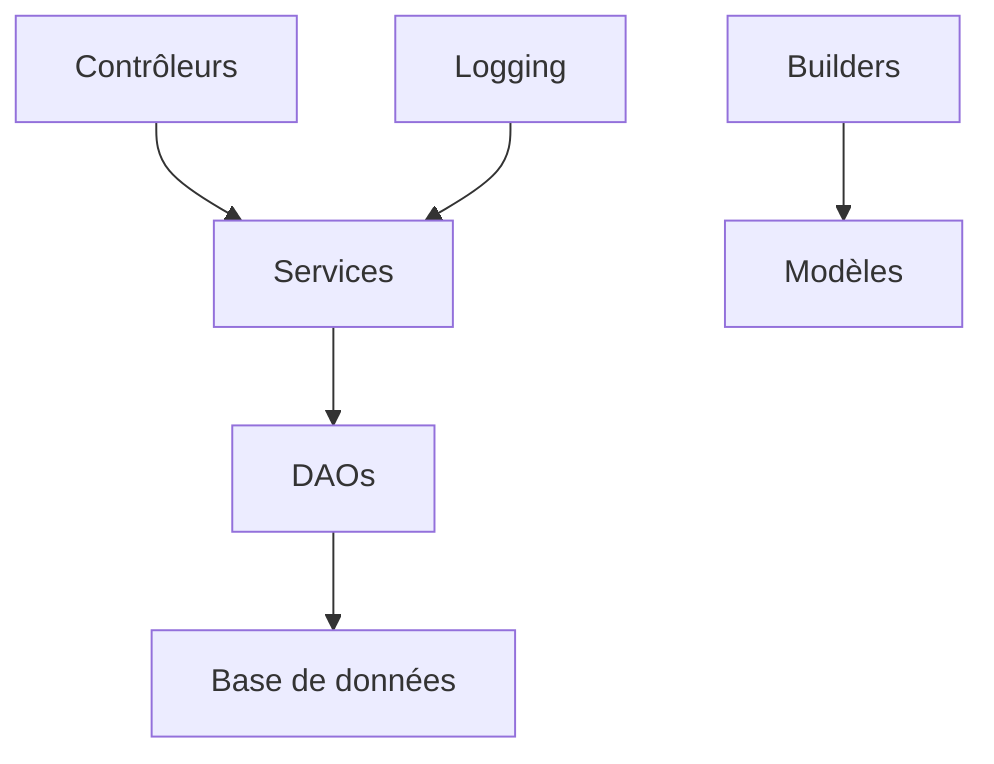
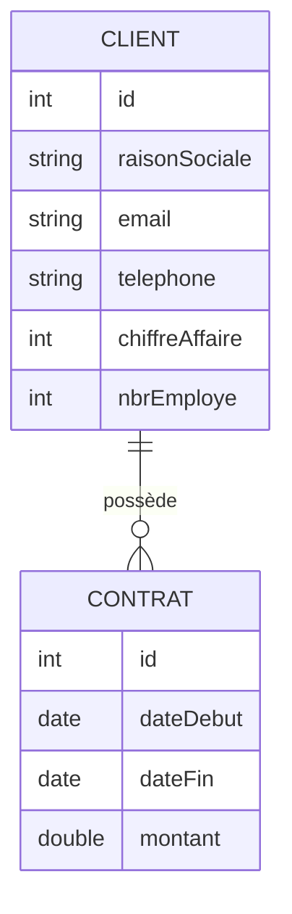

# CliprocoJEE - Application de Gestion de Clients et Prospects

## 📋 Description
CliprocoJEE est une application Java web (MVC simple) de gestion de clients et prospects, permettant de gérer efficacement les informations des entreprises, leurs contrats et leurs interactions.

## 🏗 Architecture

```mermaid
graph TD
    A[Contrôleurs] --> B[Services]
    B --> C[DAOs]
    C --> D[Base de données]
    E[Builders] --> F[Modèles]
    H[Logging] --> B
```

## 📁 Structure du Projet
```
src/
├── main/
│   ├── java/
│   │   ├── builders/      # Pattern Builder pour la création d'objets
│   │   ├── controllers/   # Contrôleurs MVC
│   │   ├── dao/           # Couche d'accès aux données
│   │   ├── exceptions/    # Gestion des exceptions personnalisées
│   │   ├── models/        # Entités JPA
│   │   ├── services/      # Logique métier
│   │   └── utilities/     # Utilitaires (validation manuelle, logging)
│   └── resources/
│       └── messages/      # Messages centralisés
└── test_backup/
    └── java/              # Tests unitaires
```

## 🛠 Technologies
| Technologie | Version | Description |
|------------|---------|-------------|
| Java | 21 | Langage principal |
| Tomcat | 11 | Serveur d'application |
| MySQL | 8.0 | Base de données |
| Maven | 3.8+ | Gestion des dépendances |
| JUnit | 5 | Tests unitaires |
| Hibernate | 6.0 | ORM |

## 🚀 Installation
```bash
# Cloner le projet
git clone https://github.com/votre-repo/CliprocoJEE.git

# Compiler le projet
mvn clean package

# Lancer l'application (Tomcat 11 requis)
# Déployer le .war généré dans le dossier webapps de Tomcat 11
```

## 💡 Fonctionnalités Principales

### 1. Gestion des Clients et Prospects
- Création, modification, suppression
- Validation manuelle des données (email, téléphone, etc.)
- Gestion des contrats associés

### 2. Validation des Données
La validation Jakarta (javax/jakarta.validation) a été supprimée. Toute validation est désormais manuelle, via des utilitaires Java (regex, etc.).

```java
// Exemple de validation d'email
public void validateEmail(String email) {
    if (email == null || !email.matches("^[a-zA-Z0-9_!#$%&'*+/=?`{|}~^.-]+@[a-zA-Z0-9.-]+$")) {
        throw new ValidationException("Email invalide");
    }
}
```

### 3. Pattern Builder
```java
// Exemple d'utilisation du Builder
Client client = ClientBuilder.getNewClientBuilder()
    .deRaisonSociale("Ma Société")
    .deMail("contact@masociete.com")
    .deChiffreAffaire(100000.0)
    .deNbrEmploye(50)
    .build();
```

## 🔒 Sécurité et Validation

### Validation des Entrées
- Email : Format RFC 5322
- Téléphone : Format français
- Chiffre d'affaires : ≥ 250
- Nombre d'employés : ≥ 1

### Gestion des Exceptions
```java
try {
    clientService.create(client);
} catch (ValidationException e) {
    // Gestion des erreurs de validation
} catch (DatabaseException e) {
    // Gestion des erreurs de base de données
}
```

## 📊 Modèle de Données

```mermaid
erDiagram
    CLIENT ||--o{ CONTRAT : possède
    CLIENT {
        int id
        string raisonSociale
        string email
        string telephone
        int chiffreAffaire
        int nbrEmploye
    }
    CONTRAT {
        int id
        date dateDebut
        date dateFin
        double montant
    }
```

## 🧪 Tests Unitaires
Les tests sont à réécrire pour la nouvelle architecture. Les anciens tests sont dans `test_backup/`.

## 📝 Messages Centralisés
Les messages d'erreur, de succès et de log sont centralisés dans `src/main/resources/messages/messages.properties`.

## 🔄 Workflow de Développement
1. Création d'une entité via le Builder
2. Validation manuelle des données
3. Persistance via le DAO
4. Tests unitaires
5. Déploiement

## 🎯 Bonnes Pratiques
1. **Validation** : Toujours valider les entrées utilisateur (manuellement)
2. **Logging** : Logger toutes les opérations importantes
3. **Exceptions** : Utiliser des exceptions personnalisées
4. **Builders** : Utiliser le pattern Builder pour la création d'objets complexes

## 🤝 Contribution
1. Fork le projet
2. Créer une branche (`git checkout -b feature/AmazingFeature`)
3. Commit les changements (`git commit -m 'Add AmazingFeature'`)
4. Push la branche (`git push origin feature/AmazingFeature`)
5. Ouvrir une Pull Request

## 📄 Licence
Ce projet est sous licence MIT. Voir le fichier `LICENSE` pour plus de détails.

## 🙏 Remerciements
- L'équipe de développement
- La communauté Java
- Les contributeurs open source 

## Déploiement et configuration Maven

### Pourquoi Cargo ou déploiement manuel ?
- Il n'existe pas de plugin Maven stable pour Tomcat 10+ ou 11.
- Déployer le .war généré dans le dossier `webapps` de Tomcat 11 est la méthode recommandée.
- Cargo peut être utilisé pour des déploiements avancés (voir pom.xml).

### Choix des versions
- **Tomcat 11.x** : dernière version stable supportant JakartaEE 11
- **Java 21** : pour profiter des dernières évolutions du langage
- **Hibernate 6.x** : ORM moderne
- **Maven 3+** : standard de l'écosystème Java

### Dépendance MySQL (corrigée)
```xml
<dependency>
    <groupId>com.mysql</groupId>
    <artifactId>mysql-connector-j</artifactId>
    <version>8.0.33</version>
</dependency>
```

### Comment déployer ?
1. Compiler le projet : `mvn clean package`
2. Copier le fichier `target/CliprocoJEE.war` dans le dossier `webapps` de Tomcat 11
3. Démarrer Tomcat 11
4. Accéder à l'application via `http://localhost:8080/CliprocoJEE/`

## ⚙️ Documentation technique détaillée

### Architecture Maven et choix techniques

#### Pourquoi Jakarta EE 11 (web-api) ?
- Permet d'utiliser les dernières fonctionnalités de la plateforme Jakarta EE.
- Compatible avec Tomcat 10+ (qui n'accepte plus javax mais uniquement jakarta).
- Le scope `provided` signifie que l'API est fournie par le serveur d'application (Tomcat).

#### Pourquoi Tomcat 10 + Cargo remote ?
- **Tomcat 10** : dernière version stable, compatible Jakarta EE 11.
- **Cargo remote** :
    - Il n'existe pas de plugin Maven stable pour Tomcat 10+ (les plugins tomcat7/8/9/10-maven-plugin sont obsolètes ou alpha).
    - Cargo permet de déployer sur un Tomcat 10 déjà installé (local ou distant) via l'API Tomcat Manager.
    - Ce mode est le plus proche d'un déploiement de production :
        * Contrôle total sur la version et la configuration de Tomcat
        * Pas de dépendance à un plugin alpha ou obsolète
        * Déploiement rapide, sans redémarrage du serveur
        * Sécurité accrue (credentials dédiés)
    - **Pré-requis** : Tomcat 10 lancé avec le manager activé et un utilisateur ayant le rôle `manager-script`.

#### Choix des versions
- **Java 21** : dernière LTS, meilleures performances et sécurité.
- **Hibernate 6.4.4** : ORM moderne, compatible Jakarta EE 11.
- **MySQL 8.0.33** : connecteur officiel, stable.
- **JUnit 5.11.0** : framework de test moderne.
- **Cargo 1.10.3** : version stable, compatible Tomcat 10.

#### Plugins Maven principaux
- **maven-war-plugin** : Packaging de l'application en WAR, avec injection des propriétés de connexion BDD.
- **cargo-maven3-plugin** : Déploiement automatique sur Tomcat 10 via l'API Manager (mode remote).
- **maven-checkstyle-plugin** : Vérification de la qualité du code.
- **maven-surefire-plugin** : Exécution des tests unitaires JUnit 5.

#### Commandes de déploiement
```sh
mvn clean package -Dmaven.test.skip=true   # Compilation sans tests
mvn cargo:deploy                           # Déploiement sur Tomcat 10
```

#### Exemple de configuration Cargo (dans pom.xml)
```xml
<!--
    Cargo en mode remote : déploiement professionnel sur Tomcat 10+
    - Nécessite Tomcat 10 lancé avec le manager activé
    - Credentials à adapter dans le pom.xml
-->
<plugin>
    <groupId>org.codehaus.cargo</groupId>
    <artifactId>cargo-maven3-plugin</artifactId>
    <version>1.10.3</version>
    <configuration>
        <container>
            <containerId>tomcat10x</containerId>
            <type>remote</type>
        </container>
        <configuration>
            <type>runtime</type>
            <properties>
                <cargo.remote.uri>http://localhost:8080/manager/text</cargo.remote.uri>
                <cargo.remote.username>admin</cargo.remote.username>
                <cargo.remote.password>admin</cargo.remote.password>
            </properties>
        </configuration>
        <deployables>
            <deployable>
                <groupId>${project.groupId}</groupId>
                <artifactId>${project.artifactId}</artifactId>
                <type>war</type>
                <properties>
                    <context>/CliprocoJEE</context>
                </properties>
            </deployable>
        </deployables>
    </configuration>
</plugin>
```

#### Remarques pédagogiques
- Le mode remote est la seule méthode fiable et maintenue pour Tomcat 10+ avec Maven.
- Les plugins Tomcat embarqués sont obsolètes ou instables.
- Cette configuration est recommandée pour tout projet professionnel ou pédagogique moderne. 

# CliprocoJEE - Déploiement avec Tomcat 11 et Maven

## Pourquoi Tomcat 11 ?
- Tomcat 11 est la version stable la plus récente, compatible Jakarta EE 11 (utilisé dans ce projet).
- Meilleure compatibilité, sécurité et support à long terme.
- Les plugins Maven pour Tomcat 10 sont instables ou inexistants, alors que Cargo supporte Tomcat 11 en mode remote.

## Installation et configuration requises

### 1. Maven (>= 3.9)
- Installé via `sudo pacman -S maven`

### 2. Tomcat 11
- Téléchargé et installé manuellement dans `/opt/tomcat11` (voir script d'installation ou instructions dans l'historique du projet).
- Service systemd créé pour gestion automatique (`/etc/systemd/system/tomcat11.service`).
- Démarrage/arrêt :
  ```bash
  sudo systemctl start tomcat11
  sudo systemctl stop tomcat11
  sudo systemctl status tomcat11
  ```

### 3. Configuration du manager Tomcat
- Fichier `/opt/tomcat11/conf/tomcat-users.xml` :
  ```xml
  <user username="admin" password="admin" roles="manager-gui,manager-script,admin-gui,admin-script"/>
  ```
- Nécessaire pour permettre le déploiement distant via Cargo.

## Déploiement avec Maven + Cargo

### Compilation sans tests (recommandé si les tests échouent) :
```bash
mvn clean package -DskipTests
```

### Déploiement sur Tomcat 11 (distant ou local) :
```bash
mvn cargo:deploy -DskipTests
```

- Le plugin Cargo est configuré pour se connecter à Tomcat 11 via l'URL manager : `http://localhost:8080/manager/text`
- Les identifiants sont ceux définis dans `tomcat-users.xml` (admin/admin par défaut, à changer en production !)

## Pourquoi ce choix ?
- **Stabilité** : Tomcat 11 est officiellement supporté, contrairement aux plugins Maven Tomcat 10.
- **Interopérabilité** : Cargo permet de déployer sur n'importe quel Tomcat distant, sans dépendre d'un plugin embarqué.
- **Simplicité** : Un seul point d'entrée pour le déploiement, facile à automatiser (CI/CD).

## Pour aller plus loin
- Modifier le mot de passe admin dans `tomcat-users.xml` pour la sécurité.
- Adapter le port ou l'URL si Tomcat n'est pas sur la même machine.
- Pour exécuter les tests :
  ```bash
  mvn test
  ```
- Pour corriger les tests, voir les erreurs de compilation dans le dossier `src/test/java`.

---

**Documentation générée automatiquement suite à la migration Tomcat 11/Cargo.** 

## 🔑 Identifiants MySQL locaux (développement)

- Utilisateur root :
  - login : root
  - mot de passe : password
- Utilisateur dev :
  - login : yglsan
  - mot de passe : password

Ces identifiants sont valables uniquement sur ta machine de développement locale. 